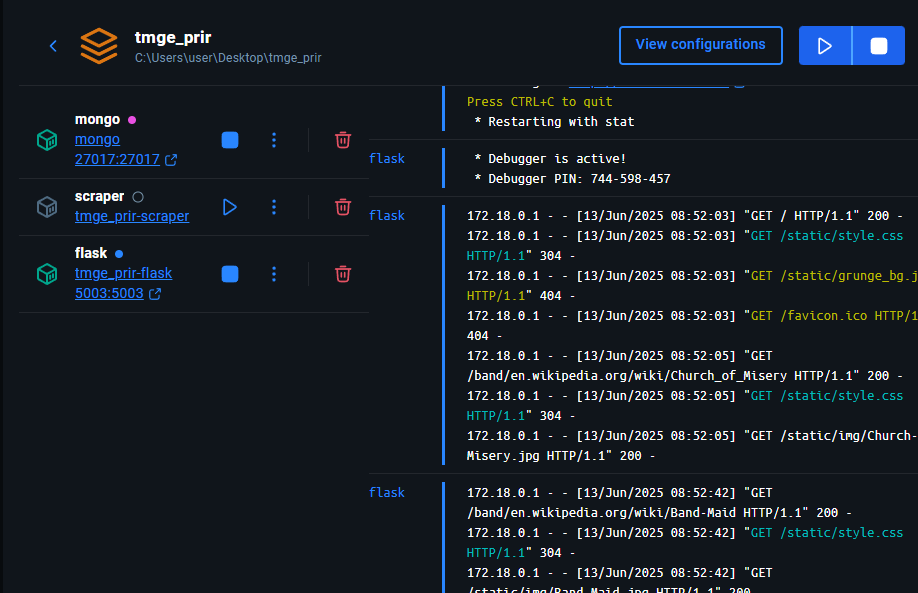
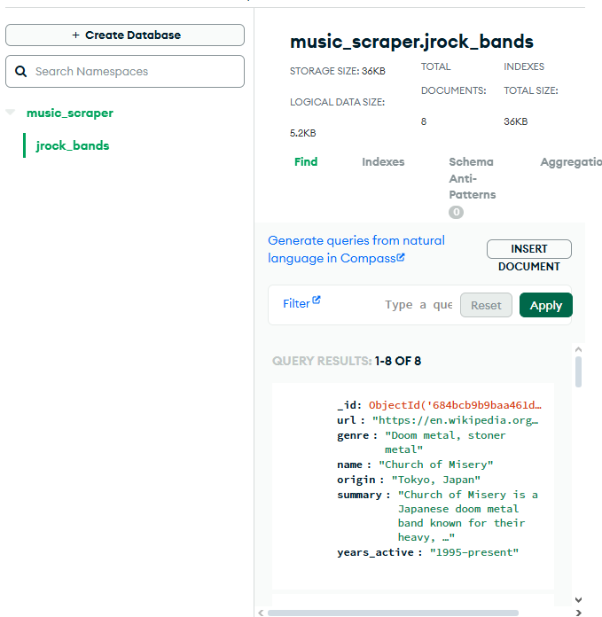

# 🕷 Web Crawler Distributed Application

Projekt aplikacji rozproszonej do selektywnego pobierania danych z witryn internetowych według zadanych profili. Zrealizowano z wykorzystaniem technologii: Python, Flask, MongoDB, multiprocessing, asyncio oraz Docker.

## 📌 Opis projektu

Aplikacja pobiera, przetwarza i zapisuje dane zgodne z ustalonym profilem danych. Całość została podzielona na 3 moduły:

- **Interfejs użytkownika (Flask)**
- **Silnik przetwarzający (multiprocessing + asyncio)**
- **Baza danych (MongoDB)**

## 📁 Struktura danych

Pobrane dane dzielą się na 4 główne grupy:
1. Adresy e-mail
2. Adresy korespondencyjne
3. Schematy organizacyjne (struktura firm, nazwiska)
4. Linki zewnętrzne i zasoby (np. do dokumentów PDF, DOCX)

## ⚙️ Technologie

- Python 3.10
- Flask
- BeautifulSoup4
- asyncio + multiprocessing
- MongoDB (zdalna lub lokalna w Dockerze)
- Docker + Docker Compose

## 🧠 Architektura


- tmge_prir/
  - gui/
    - app.py
    - templates/
    - static/
      - img/
        - Band_Maid.jpg
        - Buck_Tick.jpg
      - style.css
    - requirements.txt
    - Dockerfile
  - scraper/
    - scraper.py
    - mongo_test.py
    - requirements.txt
    - Dockerfile
  - docker-compose.yml
  - README.md


### 📦 Moduły Dockera

- `frontend`: Serwer Flask (interfejs użytkownika)
- `crawler`: Główny silnik przetwarzający dane
- `mongodb`: Baza danych z danymi wejściowymi i wynikami

## 🚀 Uruchomienie

```bash
git clone https://github.com/yunayana/tmge_prir.git
cd tmge_prir
docker-compose up --build
http://localhost:5003
```
## 🖼 Zrzuty ekranu

### Terminal 


### Docker - obrazy kontenerów


### Baza - zrzut z MongoDB



